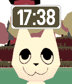
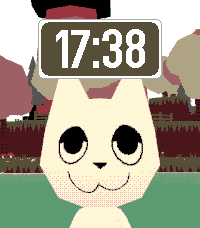

# WEBFISHING watchface

A WEBFISHING watchface for Pebble smartwatches.

    

## Features

|  Feature | Supported? |
| :-: | :-: |
| tells time | ✅ |
| he gets sad when bluetooth gone | ✅|
| goober | ✅|

## how to build the goober
Install [uv](https://docs.astral.sh/uv/) and run:

```
uv tool install pebble-tool
pebble sdk install latest
```
if you haven't already.

Clone the repo and build:

```
git clone https://github.com/nubbybubby/webfishing-watchface
cd webfishing-watchface
pebble build
```

the .pbw file will be in the build directory.
